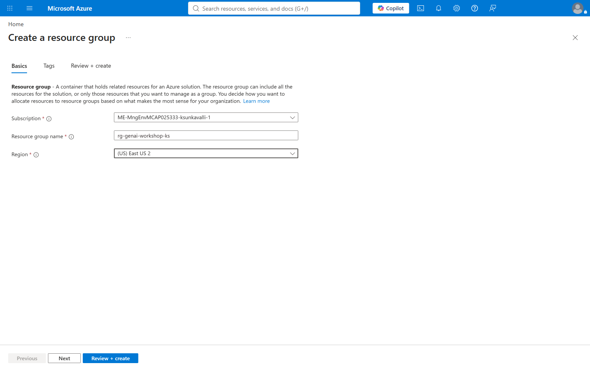
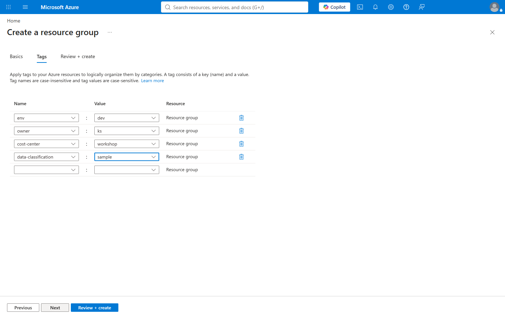
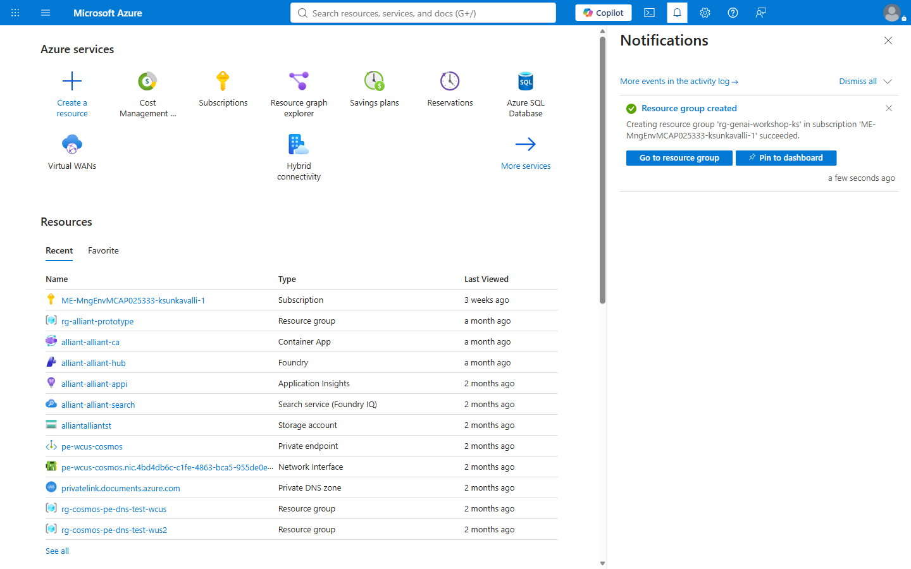
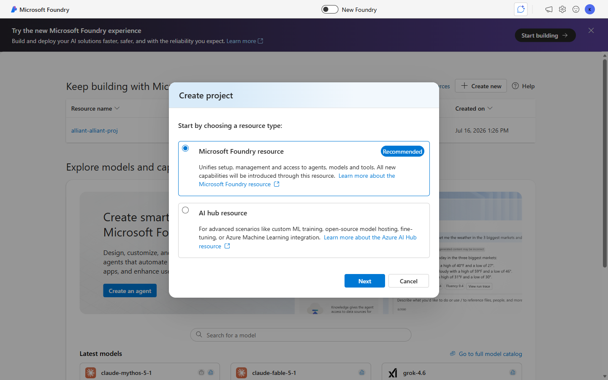
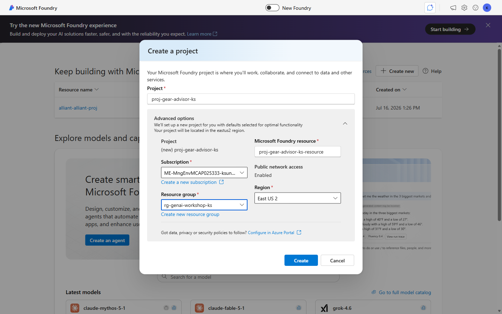
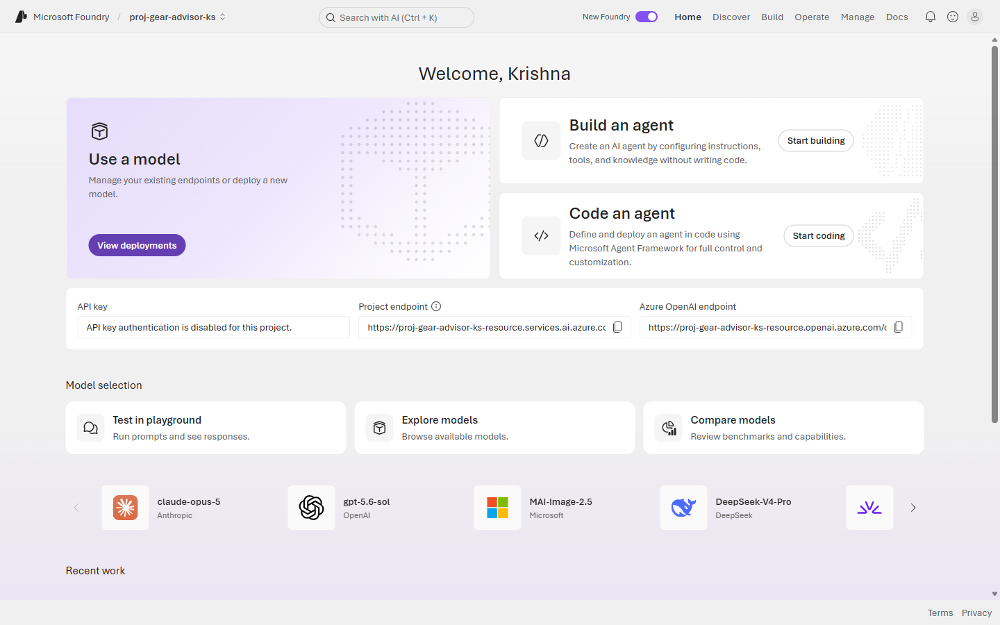
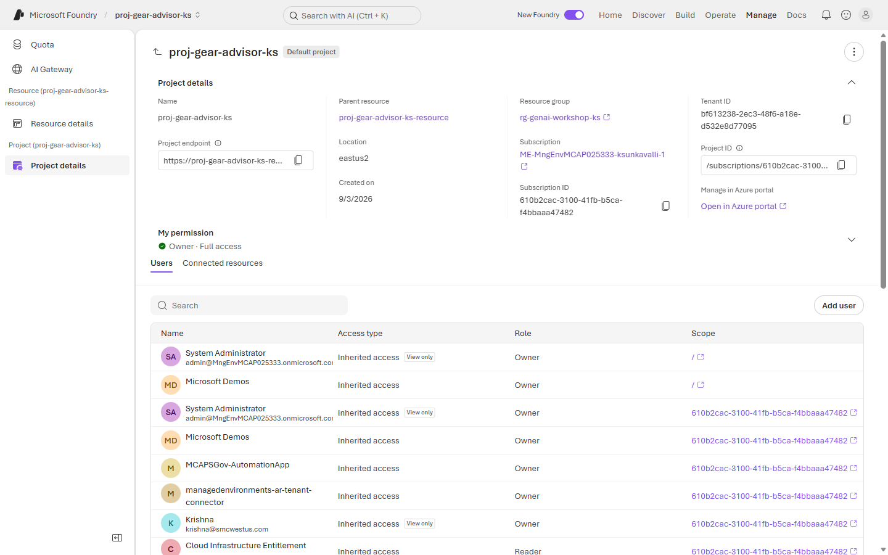

# Exercise 1: 🏗️ Provision your Foundry project

**⏱️ ~10 minutes**

Every agent needs a home. In this exercise you create the resource group and the Foundry project that will hold your models, knowledge, agents, guardrails and telemetry for the rest of the day.

> The rule to work to: *provision it the way you would hand it to an auditor — named, tagged, and owned.*

## ✅ Outcome

- A resource group with the workshop tagging standard applied
- A Foundry project you can open, with its endpoint noted
- Your own identity confirmed as an owner of the project

---

### Task 1.1: Create the resource group

1. Sign in to the [Azure portal](https://portal.azure.com) with the account that holds your subscription.

2. In the top search bar, type **Resource groups** and select it from the results.

3. Click **+ Create**, then complete the **Basics** tab:

    | Field | Value |
    |---|---|
    | Subscription | *your lab subscription* |
    | Resource group | `rg-genai-workshop-<initials>` |
    | Region | *a region with model quota **and** Azure AI Search capacity — see [Prerequisites](../Prerequisites.md)* |

    

4. Click **Next: Tags** and add the workshop tagging standard:

    | Name | Value |
    |---|---|
    | `env` | `dev` |
    | `owner` | *your alias* |
    | `cost-center` | `workshop` |
    | `data-classification` | `sample` |

    

    > 💡 Tags feel like bureaucracy on day one and become the only way to answer *"what is this costing us?"* on day ninety.

5. Click **Review + create**, then **Create**. Wait for the **Your deployment is complete** notification.

    

---

### Task 1.2: Create the Foundry project

1. Open the [Microsoft Foundry portal](https://ai.azure.com) and sign in with the same account.

2. On the landing page, click **+ Create new**. Choose **Microsoft Foundry resource** (marked *Recommended*) as the resource type, then click **Next**.

    

    > 💡 The **AI hub resource** option is for advanced scenarios — custom ML training, model fine-tuning, or Azure Machine Learning integration. For agent work, the Foundry resource is the right container.

3. Enter `proj-gear-advisor-<initials>` as the **Project name**.

4. Expand **Advanced options** and set the resource details:

    | Field | Value |
    |---|---|
    | Subscription | *your lab subscription* |
    | Resource group | `rg-genai-workshop-<initials>` |
    | Region | *the lab region* |

    

    > ⚠️ **Check the resource group.** Foundry defaults to creating a *new* one (`rg-<something>`). Select the group you created in Task 1.1 instead, or your project lands outside your tagged, budgeted container — and your clean-up script will miss it.

    > ⚠️ **Region matters twice:** it decides which models you can deploy *and* where your data resides. If you must switch regions later, you rebuild — you do not move.

5. Click **Create** and wait for provisioning to complete. This typically takes **2–4 minutes**.

6. When the project opens, note the **Project endpoint** on the home page and copy it into a scratch file. The portal labs do not need it, but it is what any SDK, CI job or `az` call against this project uses — and it is easier to grab now than to hunt for later.

    

    > 🔑 Notice **API key authentication is disabled for this project**. New Foundry projects are keyless by default — access is via Entra identity, not a shared secret. That is the right default, and it is what makes the managed-identity work in [Lab 2, Exercise 1](../Lab%202%20-%20Secure,%20evaluate%20&%20monitor%20your%20first%20agent/Exercise%201%20-%20Identity,%20networking%20and%20landing%20zone%20hardening.md) straightforward rather than a migration.

---

### Task 1.3: Verify your access

1. In the top navigation, select **Manage**. It opens on **Project details**, which shows the project endpoint, resource group, subscription and your own permission level.

    

2. Under **My permission**, confirm you see **Owner · Full access**. Then in the **Users** tab, search for your own name and check the roles listed against you.

    > 💡 Note the **Access type** column. Your access is *inherited* from the subscription, not granted on the project. That is fine for a lab and a red flag in production — inherited subscription-level Owner is exactly the over-permissioning you fix in Lab 2.

3. In the left pane, open **Resource details** to see the **parent resource** your project belongs to. Models, connections and quota are scoped to this resource, not to the project.

    > 🔑 One resource can hold **many projects** — see the **Projects** tab. That is the unit of isolation to reason about: projects share the parent's quota and connections.

> 🔒 **Landing-zone note:** in this lab you are using your own user identity for speed. In test and production the agent runtime uses a **managed identity** with least-privilege RBAC, and never your credentials. You will harden exactly this in [Lab 2, Exercise 1](../Lab%202%20-%20Secure,%20evaluate%20&%20monitor%20your%20first%20agent/Exercise%201%20-%20Identity,%20networking%20and%20landing%20zone%20hardening.md).

---

## 🧾 Checkpoint

- [ ] Resource group `rg-genai-workshop-<initials>` exists, with four tags
- [ ] Project `proj-gear-advisor-<initials>` opens in the Foundry portal, **inside `rg-genai-workshop-<initials>`** — check Manage → Resource details, not just that it opened
- [ ] Project endpoint saved in your scratch file
- [ ] Your identity is confirmed on the project

---

## 🧠 What we learned

- A Foundry **project** is the container for models, knowledge, agents, guardrails and telemetry — scope it per workload, per environment.
- Projects sit inside a **parent resource** that owns quota and connections, and one resource can hold many projects.
- **Region** is a one-way door for both capability and data residency.
- New projects are **keyless by default** — identity, not shared secrets.
- Tagging and named ownership are cheap at creation and expensive to retrofit.

---

**Next:** [Exercise 2 — Deploy a model ▶️](./Exercise%202%20-%20Deploy%20a%20model.md)
