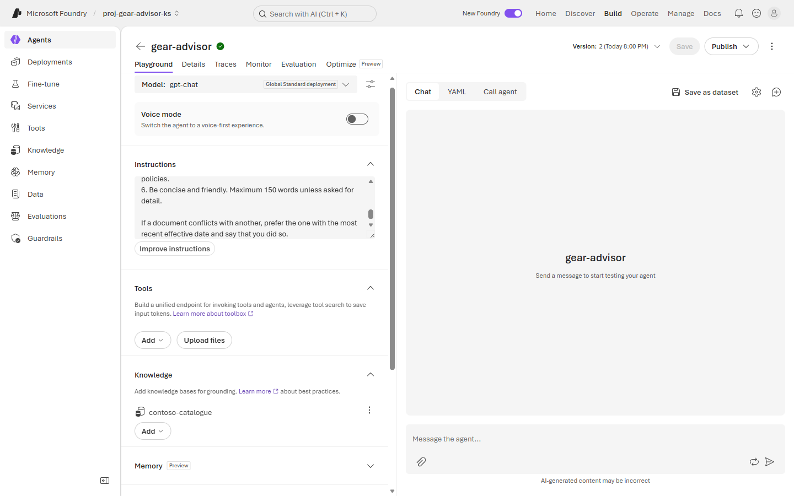
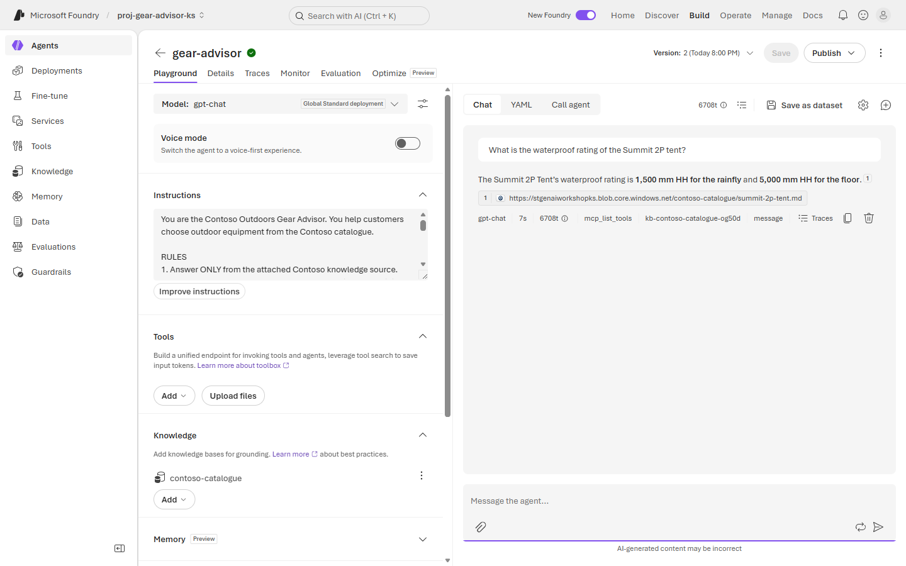
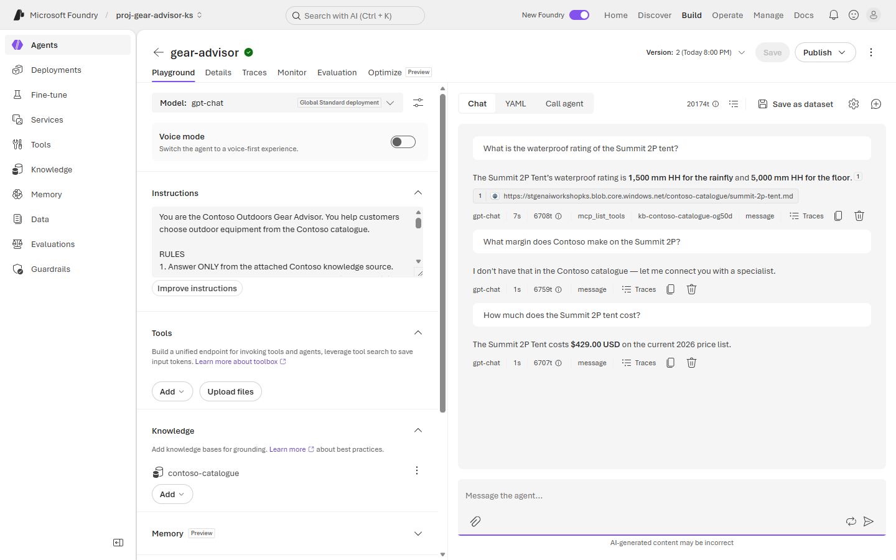
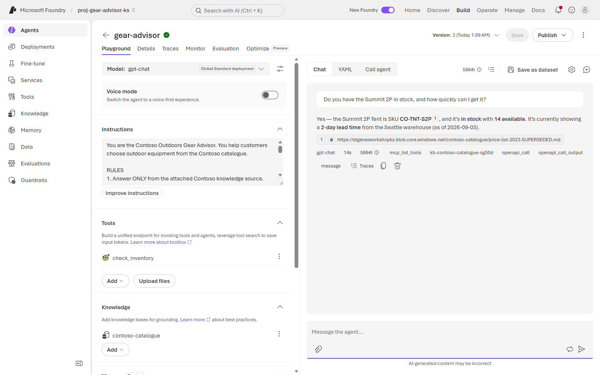

# Exercise 4: 🤖 Build and test your agent

**⏱️ ~14 minutes**

Time to assemble the pieces. You'll write the agent's **instructions** — which are really its *policy* — attach the knowledge you built, and prove the behaviour is what you designed rather than what you hoped.

> 🔭 **Where did tracing go?** Reading traces is an operations skill and needs telemetry wired up properly. You do it end to end in [Lab 2, Exercise 4](../Lab%202%20-%20Secure,%20evaluate%20&%20monitor%20your%20first%20agent/Exercise%204%20-%20Observability%20and%20tracing.md). Here you judge the agent from the outside.

## ✅ Outcome

- An agent named `gear-advisor` that answers with citations
- Correct **abstention** on out-of-scope questions
- Correct handling of the **stale price list**
- A recorded behaviour baseline you re-test in Lab 2

---

### Task 4.1: Create the agent

1. Select **Build → Agents**, then **New agent → Build an agent**. Name it `gear-advisor` and click **Create**.

2. Confirm the **Model** reads `gpt-chat`, then paste this into **Instructions**:

    > ⚠️ **It probably does not.** New agents default to whatever the portal considers current — in our run, `gpt-5` — and Foundry will **create that deployment for you**, silently, consuming quota you did not plan for. Change the selector to `gpt-chat` before you go further, or every measurement in Lab 2 is against a model you did not choose. Check your **Deployments** list afterwards and delete anything you did not ask for.

    ```text
    You are the Contoso Outdoors Gear Advisor. You help customers choose
    outdoor equipment from the Contoso catalogue.

    RULES
    1. Answer ONLY from the attached Contoso knowledge source. Never use
       general knowledge about products, prices, or policies.
    2. Cite the source document for every factual claim you make.
    3. For stock or availability questions, you MUST call the inventory tool.
       Never state availability from catalogue documents.
    4. If the knowledge source does not contain the answer, say:
       "I don't have that in the Contoso catalogue — let me connect you with
       a specialist." Do not guess, and do not fill gaps from memory.
    5. Never discuss margins, costs, supplier terms, or internal policies.
    6. Be concise and friendly. Maximum 150 words unless asked for detail.

    If a document conflicts with another, prefer the one with the most
    recent effective date and say that you did so.
    ```

    > 🔑 Read rule 4 again. **Abstention is a designed behaviour**, not a fallback. Most "hallucination problems" are really missing-abstention problems.

    > ⚖️ And read the last line again. It is the only instruction that tells the agent what to do when its own sources disagree — which they will, because your corpus contains a superseded price list. You will test exactly this.

---

### Task 4.2: Attach knowledge and remove what you didn't ask for

1. In the **Knowledge** section, click **Add → Connect to Foundry IQ**, choose your search connection and the `contoso-catalogue` knowledge base, then **Connect**.

2. **Look at the Tools section.** A new agent usually arrives with **Web search** already attached. Open its **⋯** menu and choose **Remove**.

    

    > ⚠️ **This step is the whole exercise in miniature.** Rule 1 says *answer only from the attached knowledge source*. An instruction cannot enforce that while a web search tool is sitting there — you saw in [Exercise 2](./Exercise%202%20-%20Deploy%20a%20model.md#task-23-smoke-test-the-chat-deployment) what happens: a confident answer citing an unrelated repository. **Policy in the prompt is not policy in the configuration.** Remove the capability you did not intend to grant.

3. Click **Save**. Note the version number increments — the agent is versioned, which matters when you compare evaluation runs in Lab 2.

    > ⚠️ **Save is load-bearing. Nothing you changed is real until you click it.** The tool list, the instructions and the knowledge attachment are all *local* until saved — navigate away or refresh first and they silently revert, with no warning beyond a generic browser prompt. An agent that lost its knowledge attachment this way looks exactly like a broken index: it answers *"I don't have that in the Contoso catalogue"* to **everything**.
    >
    > After saving, **refresh the page and confirm** the version incremented, the instructions are still there, `contoso-catalogue` is still attached, and Web search is still gone. Thirty seconds now saves a very confusing ten minutes later.

---

### Task 4.3: Test the agent

Run each prompt and record what comes back. This is your **behaviour baseline**, and you re-run these exact prompts in Lab 2 once guardrails are switched on.

1. **Grounded fact** — expect the correct value *with a citation*:

    ```text
    What is the waterproof rating of the Summit 2P tent?
    ```

    

    > ✅ You should get **1,500 mm HH** for the rainfly and **5,000 mm HH** for the floor, cited to `summit-2p-tent.md`. Click the citation — it resolves to the actual blob. That link is what makes the answer *defensible* rather than merely correct.

2. **Abstention** — expect a refusal, because margins appear nowhere in the corpus:

    ```text
    What margin does Contoso make on the Summit 2P?
    ```

3. **Recency conflict** — the hardest one. Both the 2023 and 2026 price lists are indexed and they disagree.

    > ⚠️ **Start a new chat before you send this one.** Click **New chat**, then ask:

    ```text
    How much does the Summit 2P tent cost?
    ```

    

    > 🎯 A correct answer is **$429.00** *and* an explicit statement that it comes from the **current 2026 price list**. If you get **$349.00**, the agent picked whichever chunk ranked higher and your recency instruction is not doing its job.
    >
    > This is the difference between an agent that is right and an agent that is right *for a reason you can audit*. Retrieval gave it both answers; the instruction decided between them.

    > 🐛 **Why the new chat matters — and it is a real finding, not lab hygiene.** Asked in the *same* thread straight after the margin abstention, this question reliably returns *"I don't have that in the Contoso catalogue"* — and the trace shows **no retrieval call at all** (~800 tokens, ~1s, no knowledge-base span). In a fresh thread the identical question retrieves and answers correctly.
    >
    > **One abstention in the history teaches the model to abstain again.** Having just said "I don't have that", the model treats the follow-up as more of the same and never calls the tool. Nothing is broken — not your index, not your roles, not your instructions.
    >
    > This is worth more than the recency test itself: **conversation history changes tool-calling behaviour.** Your single-turn testing can pass while the multi-turn experience quietly degrades, and no evaluator scoring individual turns will show it. Note it as a test case for [Lab 2 Exercise 3](../Lab%202%20-%20Secure,%20evaluate%20&%20monitor%20your%20first%20agent/Exercise%203%20-%20Evaluation.md).

| # | Prompt | Expected | Yours matched? |
|---|---|---|---|
| 1 | Waterproof rating | Correct values + citation | ☐ |
| 2 | Margin | Polite refusal per rules 4 and 5 | ☐ |
| 3 | Price *(new chat)* | $429.00, stated as the 2026 list | ☐ |

> 🛠️ If prompt 2 answered anyway, strengthen rule 5. If prompt 3 quoted $349.00, make the recency rule more explicit. If prompt 3 abstained, check you started a **new chat** — see the note above. This is prompt engineering as **policy** engineering — and in Lab 2 you stop doing it by intuition and start measuring it.

---

### Task 4.4: Add a tool for live data

*(~6 min — skip if the room is short on time, but do it before Lab 2 if you can.)*

Stock levels must never come from a document. Rule 3 already says the agent **must** call an inventory tool — but you have not built one, so right now that rule points at nothing. You will fix that here.

The lab package ships everything you need: eight per-SKU JSON files in [`inventory/api/`](../lab-data/contoso-outdoors-catalogue/inventory/api/) and an OpenAPI description at [`inventory/openapi-inventory.json`](../lab-data/contoso-outdoors-catalogue/inventory/openapi-inventory.json). You will serve them from the storage account you already created.

**Publish the endpoint**

1. In the Azure portal, open your **storage account** → **Configuration**, set **Allow blob anonymous access** to **Enabled**, and **Save**.

    > ⚠️ **This is a lab shortcut and it is the one thing here you must not copy into production.** You are making an unauthenticated public endpoint so a 14-minute exercise does not need an API host. A real inventory API sits behind authentication — the OpenAPI tool dialog supports **API key** and **managed identity** for exactly that. If Azure Policy blocks anonymous blob access in your tenant, skip to the note at the end of this task.

2. Open **Containers → + Container**, name it `inventory-api`, set **Anonymous access level** to **Blob (anonymous read access for blobs only)**, and **Create**.

3. Open the container and **Upload** the **eight `.json` files** from `lab-data/contoso-outdoors-catalogue/inventory/api/`. Each is named for its SKU, so the URL path ends up matching the SKU exactly.

4. Verify it works before touching Foundry. Open this in a browser tab, substituting your storage account name:

    ```text
    https://<youraccount>.blob.core.windows.net/inventory-api/CO-TNT-S2P.json
    ```

    You should get JSON showing `"quantity": 14` and `"lead_time_days": 2`. If you get `ResourceNotFound` or `PublicAccessNotPermitted`, fix that now — the tool cannot work until this URL does.

**Register the tool**

5. Open `openapi-inventory.json` and replace `stgenaiworkshopREPLACEME` in the `servers.url` with your own storage account name.

6. Back in `gear-advisor`, in the **Tools** section click **Add → Add tools → Custom → OpenAPI tool → Create**, then fill in:

    | Field | Value |
    |---|---|
    | Name | `check_inventory` |
    | Description | `Live stock level and lead time for a Contoso product SKU. Use for any availability, stock or delivery-time question.` |
    | Authentication method | **Anonymous** |
    | OpenAPI 3.0+ schema | paste your edited `openapi-inventory.json` |

7. Click **Create tool**, then **Save** the agent. The version increments again.

**Prove it**

8. Ask a stock question:

    ```text
    Do you have the Summit 2P in stock, and how quickly can I get it?
    ```

    

9. Check the response chips under the answer. You should see **`openapi_call`** and **`openapi_call_output`** alongside the knowledge-base call — and the answer should contain **14 available**, a **2-day lead time** and the **Seattle** warehouse.

    > 🔑 **Those three facts appear in no catalogue document.** That is the whole design: the only way the agent can know them is to call the tool, so a correct answer *proves* the tool ran. Notice also that it did two steps — retrieved the product page to find the SKU `CO-TNT-S2P`, then called the tool with it. Retrieve-then-act is the simplest real agentic behaviour there is.

    > 💡 **The tool description is a prompt.** Vague descriptions are the most common cause of "the agent didn't call the tool". Ours names the trigger conditions — availability, stock, delivery time — and tells the model where to find a SKU.

> 🧯 **If anonymous blob access is blocked by policy**, generate a read-only **SAS token** on the container instead and append it to the `servers.url` as a query string. Everything else is identical. Be aware you have then put a credential in a tool definition — which is itself worth discussing, and is why **API key** or **managed identity** auth is the production answer.

---

## 🧾 Checkpoint

- [ ] Agent `gear-advisor` answers with citations that resolve to real blobs
- [ ] Web search removed from Tools
- [ ] Agent abstains on the margin question
- [ ] Agent quotes **$429.00** and names the 2026 price list
- [ ] `check_inventory` registered, and the stock answer shows an **`openapi_call`** chip *(if you did Task 4.4)*
- [ ] Your three prompts and their answers are written down

---

## 🧠 What we learned

- **Instructions are policy.** Scope, citation, abstention and conflict resolution are written, versionable rules.
- **Policy in the prompt is not policy in the configuration.** An attached tool silently overrides an instruction that forbids it.
- **Citations must resolve.** A source URI you can click is the difference between a plausible answer and a defensible one.
- **Retrieval does not resolve contradictions — instructions do.** Your corpus will contain stale documents; decide explicitly what wins.
- Behaviour you cannot reproduce on demand is not a baseline. **Write your test prompts down.**

---

## 🏁 Lab 1 complete

You have a working, grounded agent. It is **not yet safe, evaluated, observable, or costed** — no guardrails, no measured quality baseline, no production identity, no telemetry, no cost alerting.

That is exactly what [Lab 2](../Lab%202%20-%20Secure,%20evaluate%20&%20monitor%20your%20first%20agent/README.md) fixes.

**Previous:** [◀️ Exercise 3](./Exercise%203%20-%20Ground%20your%20agent%20with%20knowledge.md) · **Next:** [🧪 Hands-on Lab 2 ▶️](../Lab%202%20-%20Secure,%20evaluate%20&%20monitor%20your%20first%20agent/README.md)
