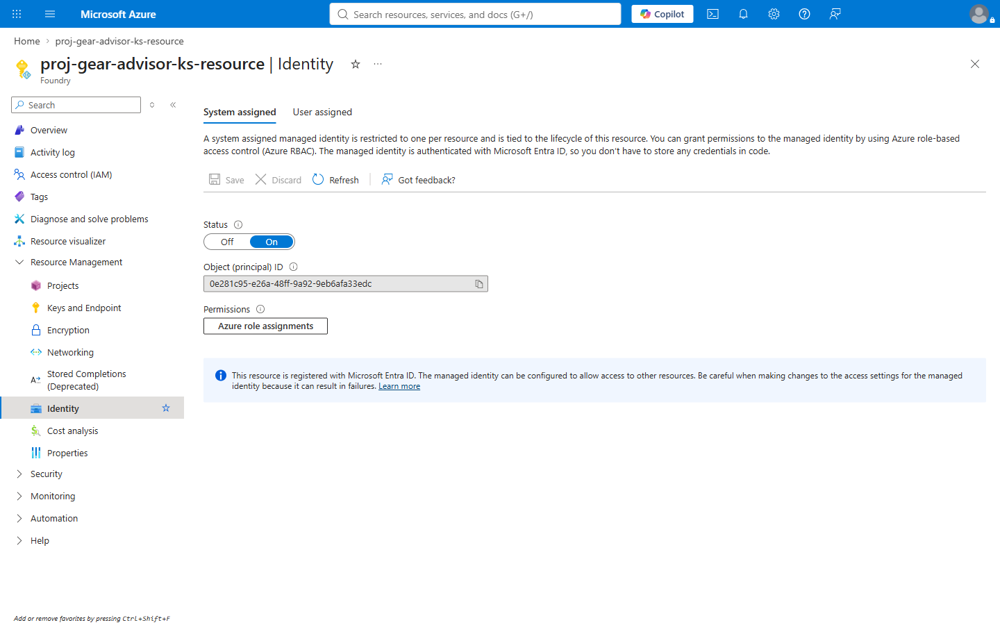
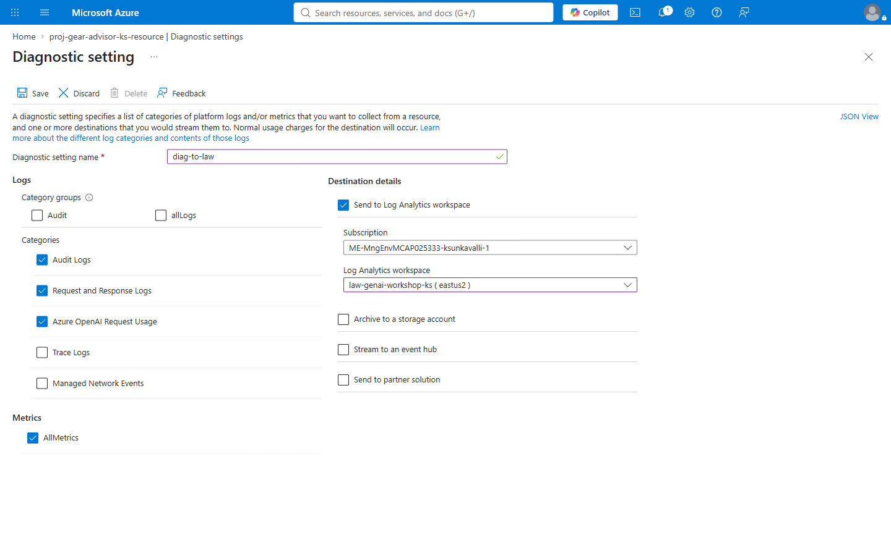
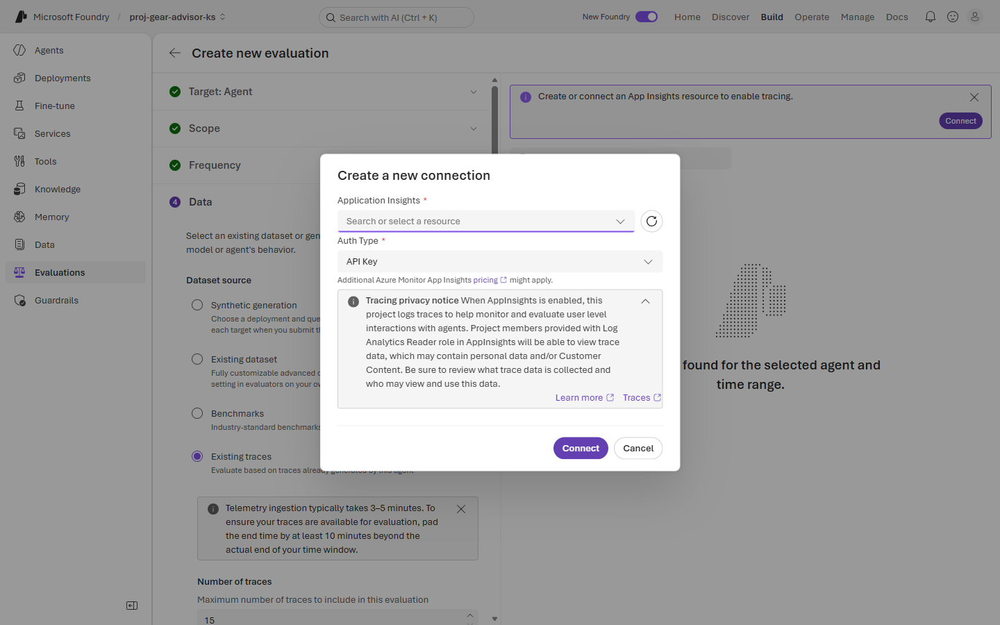
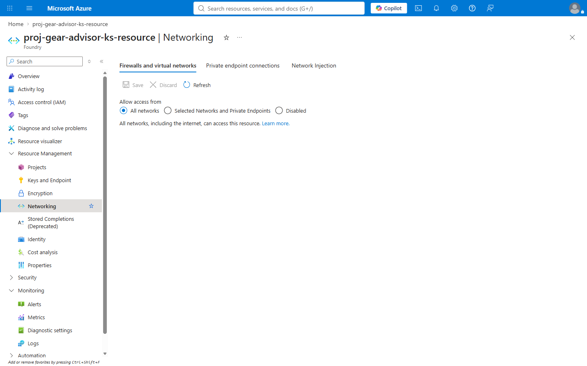

# Exercise 1: 🏛️ Identity, networking and landing zone hardening

**⏱️ ~10 minutes**

Your Lab 1 agent runs as **you**. That is fine for a prototype and unacceptable anywhere else. In this exercise you give the workload its own identity, scope what it can reach, and see what production networking would change.

This is **landing-zone design** in practice.

## ✅ Outcome

- An audit of the identities and role assignments Lab 1 created reactively
- A named over-permissioning finding you can take to your own environment
- Diagnostic settings routed to a Log Analytics workspace you own
- A documented view of what still needs to change for production

---

### Task 1.1: Audit the identity you already have

Lab 1 forced you to create identities and role assignments *reactively*, to make grounding work at all. Now look at them deliberately.

1. Open the **Foundry resource** in `rg-genai-workshop-<initials>`, then **Resource Management → Identity**.

2. Note that **System assigned** is already **On**, with an Object (principal) ID. Copy it into your scratch file.

    

    > 🔑 This principal is the workload's identity. Every grant goes to **it**, never to a person, and there is no key to leak or rotate.

    > ⚖️ **Compare with the search service.** Foundry enabled this for you; Azure AI Search did **not** — in Lab 1 you had to switch it on by hand before anything worked. Two Microsoft services, two defaults. Never assume an identity exists because the platform "should" have created one.

---

### Task 1.2: Check least privilege on what Lab 1 granted

1. Open the **search service** → **Access control (IAM)** → **Role assignments**.

2. Lab 1 created three grants, and they are **not all visible from one blade** — which is the point. Check each against its job:

    | Principal | Role | Where to see it | Correct? |
    |---|---|---|---|
    | Foundry resource + project | Search Index Data **Reader** | Search service → IAM | ✅ The agent only queries |
    | Search service identity | Cognitive Services **User** | **Foundry resource → IAM** | ✅ It only calls the embedding model |
    | **Your user account** | Owner, *inherited from subscription* | Search service → IAM | ❌ |

    > 🔑 **Two blades, because the grants point in opposite directions.** The agent reads the index, so that grant lives on the *search service*. Search calls your embedding model, so that grant lives on the *Foundry resource*. If you only ever look at one resource's IAM blade you will conclude a role is missing when it is simply somewhere else. Directional grants need directional auditing.

    > ⚠️ **Read, not write.** The agent queries the index; the *indexer* writes it. Two jobs, two identities. If you had granted Search Index Data **Contributor** it would have worked identically — and that is exactly why over-permissioning survives code review.

3. Look at the **Scope** column on your own account. Your access is **inherited** from the subscription, not granted here. In production this is the finding an auditor opens with: a human with standing write access to the data plane, which no one ever explicitly decided to give them.

---

### Task 1.3: Route diagnostics to Log Analytics

1. Create a **Log Analytics workspace** named `law-genai-workshop-<initials>` in your resource group.

2. On the Foundry resource, open **Monitoring → Diagnostic settings → + Add diagnostic setting**. Name it `diag-to-law` and select:

    | Category | Why |
    |---|---|
    | **Audit Logs** | Who called what |
    | **Request and Response Logs** | The content of each call |
    | **Azure OpenAI Request Usage** | **Token counts — the cost signal** |
    | **AllMetrics** | Latency, throttling, error rates |

    Send to your **new** workspace, then **Save**.

    

    > ⚠️ **Check the workspace name before saving.** The portal pre-selects the first workspace in the subscription, which in a shared tenant belongs to somebody else's project. Sending your logs there is both a data-mixing problem and a billing one.

    > 💰 Log Analytics **ingestion is billed by volume**, and *Request and Response Logs* is the expensive one because it stores prompts and completions. Right for a lab and for regulated production; elsewhere, sample it and tier retention.

3. You will query this workspace in [Exercise 4](./Exercise%204%20-%20Observability%20and%20tracing.md) and [Exercise 5](./Exercise%205%20-%20Cost%20monitoring%20and%20FinOps.md).

    > ⏳ **Logs are not retroactive.** Nothing you did in Lab 1 is in this workspace, because the setting did not exist yet. That is the whole argument for turning diagnostics on at provisioning time rather than at incident time.

---

### Task 1.4: Connect Application Insights — do this now, not later

Diagnostic settings capture what the **model** did. They do **not** capture agent **traces** — the span tree showing retrieval, tool calls and guardrail decisions. Those need Application Insights, and the agent emits nothing until it is connected.

1. Create an **Application Insights** resource named `appi-genai-workshop-<initials>` in your resource group, pointing at the Log Analytics workspace from Task 1.3.

2. In Foundry, connect it to the project. You will be shown a **tracing privacy notice** — read it:

    

    > *"When AppInsights is enabled, this project logs traces to help monitor and evaluate user level interactions with agents. Project members provided with Log Analytics Reader role in AppInsights will be able to view trace data, which may contain personal data and/or Customer Content."*

    > ⚠️ **Traces contain prompts and completions.** In a customer-facing agent that is customer content, and anyone with Log Analytics Reader can read it. Decide who holds that role *before* you switch tracing on, not after your first incident review.

    > 🔑 **Order matters more than it looks.** Evaluation-from-traces, the trace walk in Exercise 4, and the token queries in Exercise 5 all depend on this connection existing **before** the traffic they analyse. Connect it here, then use the agent — not the other way round.

    > ⏳ Telemetry ingestion takes **3–5 minutes**. When you later select a time window for evaluation, pad the end by **10 minutes** or your most recent turns will be missing.

---

### Task 1.5: Inspect the network posture

You will **not** enable private networking in the lab — it would break the portal experience you need for the remaining exercises. Instead, see where it lives and record the gap.

1. On the AI resource, open **Networking**.

2. Note the current setting — **Allow access from: All networks** — and the banner confirming *"All networks, including the internet, can access this resource."* Check the **Private endpoint connections** and **Network Injection** tabs, which is where production would lock this down.

    

3. Complete this production-readiness gap table for your own environment:

    | Control | Lab state | Production target | Owner |
    |---|---|---|---|
    | **Retrieval identity** | **Service identity reads the whole index** | **Query-time trimming to the calling user** | |
    | Public network access | Enabled | **Disabled** | |
    | Private endpoints (AI, search, storage) | None | **All three** | |
    | Private DNS zones | None | **Required** | |
    | Egress allow-list for tool calls | None | **Tool endpoints only** | |
    | Customer-managed keys | Service-managed | Per policy | |
    | Environment separation | Dev only | **Dev / test / prod** | |

    > ⚠️ **The first row is the one that leaks data, and it is not a networking control.** In [Lab 1 Exercise 3](../Lab%201%20-%20Build%20your%20first%20Agent%20on%20Foundry/Exercise%203%20-%20Ground%20your%20agent%20with%20knowledge.md) you granted **Search Index Data Reader** to the agent's identity, so retrieval runs as the *service* and every user sees every chunk. Harmless for a public product catalogue; a permission bypass the moment the index contains anything with per-user ACLs. Private endpoints do **not** mitigate it — the caller is already inside. Fix it with `acl_ids` filtering or on-behalf-of token propagation.

> ⚠️ **The sequencing trap:** teams routinely build the agent on public endpoints and enable private networking at the end — then spend weeks fixing broken retrieval and tool calls. Do the network design in the **same sprint** as the prototype.

---

## 🧾 Checkpoint

- [ ] Foundry resource principal ID recorded
- [ ] Lab 1's role assignments reviewed against least privilege
- [ ] **Service-identity retrieval recorded as a production gap** — it is not fixed by networking
- [ ] Your own inherited subscription-level access identified as the finding it is
- [ ] Log Analytics workspace created **in your own resource group**
- [ ] Diagnostic settings sending Audit, Request/Response, **Azure OpenAI Request Usage** and AllMetrics
- [ ] **Application Insights created and connected to the project** — required before any agent traces exist
- [ ] Production gap table completed with named owners

---

## 🧠 What we learned

- **Managed identity removes an entire class of incident** — there is no key to leak.
- **Defaults differ between services.** Foundry enabled its identity; AI Search did not. Verify, never assume.
- Grants are **per-resource, per-role and directional**: the agent reads the index, the indexer writes it, and search calls the model.
- **Inherited access is the finding you will actually get written up for** — nobody decided to grant it, which is precisely the problem.
- **Diagnostics must be on before you need them**; logs are not retroactive, and nothing from Lab 1 is in your workspace.
- Private networking is a **design-time** decision, not a hardening afterthought.

---

**Next:** [Exercise 2 — Guardrails & content safety ▶️](./Exercise%202%20-%20Guardrails%20and%20content%20safety.md)
