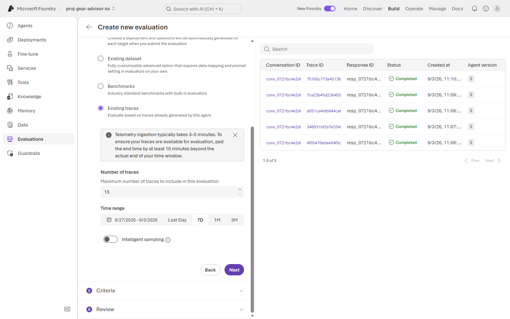
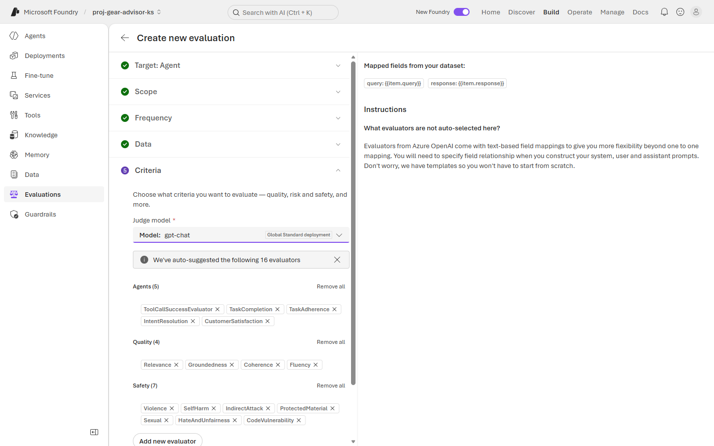
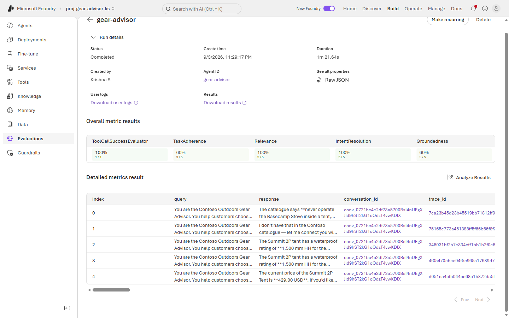
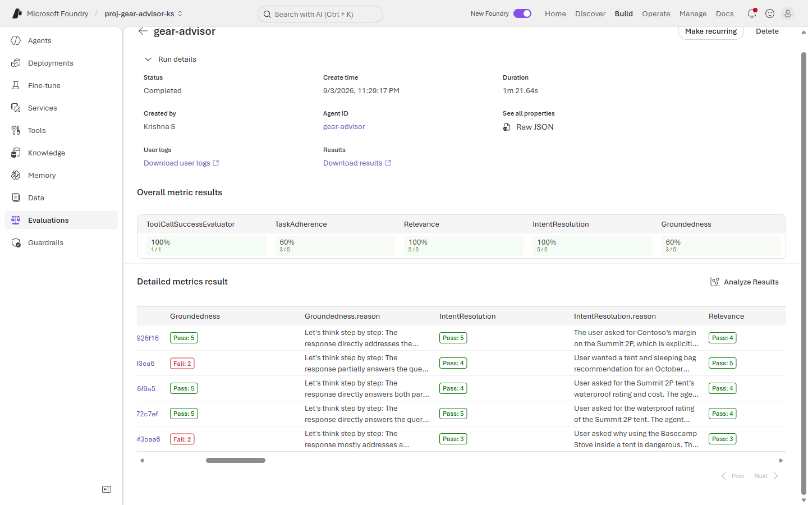

# Exercise 3: 📊 Evaluation

**⏱️ ~12 minutes**

*"Is it good?"* is not an opinion — it's a measurement. In this exercise you score the traffic you already generated, then read the scores critically.

You will get a result that looks bad. Most of it will turn out to be the *evaluation harness* being wrong, not the agent. That is the real lesson: **your first evaluation run mostly measures your evaluation setup.**

This is **evaluation** in practice.

## ✅ Outcome

- An evaluation run scored against the traces from Exercise 2
- A deliberate reduction from 16 auto-suggested evaluators to 5
- Your "failures" diagnosed — and correctly attributed to the harness, not the agent
- At least one real defect that the evaluators **missed**
- Promotion thresholds written down

> **Prerequisite:** Application Insights must already be connected to the project — you did this in [Exercise 1, Task 1.4](./Exercise%201%20-%20Identity,%20networking%20and%20landing%20zone%20hardening.md). Without it, the **Existing traces** option in Task 3.1 returns nothing.

---

### Task 3.1: Create the evaluation

1. In your project, select **Evaluations** from the left pane, then click **+ Create**.

2. **Target** — select **Agent** and tick **`gear-advisor`**. Click **Next**.

3. **Scope** — select **Individual turns**. Click **Next**.

    > 💡 **Individual turns** scores each question/answer pair separately. **Entire conversation** scores the thread as a whole. Turns is the right default for Q&A, but keep the choice in mind — it causes a problem you will diagnose in Task 3.3.

4. **Frequency** — select **One time**. Click **Next**.

    > 💡 **Recurring** is how you catch regressions: the same evaluation re-runs on a schedule against fresh traffic. Use One time here so the lab finishes.

5. **Data** — select **Existing traces**. Leave **Number of traces** at `15` and the time range at **7D**.

    

    Only the traces you actually generated appear — five turns from one conversation. That is your test set. You did not have to write it.

    > ⚠️ If the grid is empty, the portal will offer a **Resolve** button. The project's managed identity needs **Monitoring Reader** on the Application Insights resource to read its own traces. Grant it, then click **Check now**.

    > ⏳ The portal warns that telemetry ingestion takes 3–5 minutes. Pad your end time by 10 minutes beyond your last question or you will silently evaluate fewer turns than you think.

6. Click **Next**.

---

### Task 3.2: Cut the evaluator list

Foundry auto-suggests **16 evaluators** — 5 agent, 4 quality, 7 safety.

Do not accept that. Every evaluator is a judge-model call **per row**. Sixteen evaluators × your rows is a real bill, and most of them will not tell you anything you can act on.

1. Under **Safety (7)**, click **Remove all**.

    > 🔑 You already block hate, self-harm, sexual and violent content at the **guardrail**, at user input, before the model runs ([Exercise 2](./Exercise%202%20-%20Guardrails%20and%20content%20safety.md)). Scoring for it again downstream is paying twice to be told the control you configured is working. Run safety evaluators when you are *testing the guardrail itself*, not on every routine run.

2. Remove **Coherence** and **Fluency** from **Quality**.

    > These measure whether the answer reads well. A frontier model is fluent even when it is confidently wrong — fluency scores stay high while the thing you actually care about fails.

3. Remove **TaskCompletion** and **CustomerSatisfaction** from **Agents**.

You should be left with **5**: `ToolCallSuccessEvaluator`, `TaskAdherence`, `IntentResolution`, `Relevance`, `Groundedness`.

4. Note the **Judge model** at the top — it defaults to **`gpt-chat`**, the same deployment your agent uses.

    > ⚠️ **The model is grading itself.** That is the default, and it is a real limitation. A judge shares its parent model's blind spots — it is least likely to catch exactly the errors that model is prone to making. In production, judge with a *different* model, and calibrate the judge against human labels before you trust it.

5. Click **Next**. Name the run `eval-gear-advisor-baseline` and click **Submit**.

The run takes about **90 seconds** for five turns.

---

### Task 3.3: Read the scores critically

Open the completed run.

> ⚠️ **Your scores will not match anyone else's, and that is expected.** Evaluator scores depend on the traffic you generated, the model version you deployed, and the judge's own non-determinism. Two runs of this lab produced, for example:
>
> | Evaluator | Run A | Run B |
> |---|---|---|
> | ToolCallSuccessEvaluator | 100% (1 / 1) | **0% (0 / 0)** |
> | TaskAdherence | 60% (3 / 5) | 17% (2 / 12) |
> | Relevance | 100% (5 / 5) | 75% (9 / 12) |
> | IntentResolution | 100% (5 / 5) | 83% (10 / 12) |
> | Groundedness | 60% (3 / 5) | 100% (12 / 12) |
>
> **Do not chase these numbers.** What reproduces is the *shape* of the problem, and that is what the rest of this task teaches: green metrics with tiny denominators, failures that turn out to be the harness, and a real defect the evaluators miss entirely.

Work through your own results with the three lenses below.

#### 3.3a — The percentage that means nothing

Look at `ToolCallSuccessEvaluator` and read the **fraction**, not the percentage.

In Run A it scored **1 / 1** — a green 100% computed over a single sample, with four rows reading **Skipped** (*"No actual tool calls are present in the input… evaluation is skipped"*). In Run B it scored **0 / 0**, which the portal renders as a red **0%**.

Both are the same non-result wearing different colours. **A metric with a denominator of 0 or 1 is not evidence of anything**, and a red 0% over zero samples will send you debugging an agent that is working fine. Always read the fraction.

> 🔍 **Why the denominator is so often 0 or 1 here.** The evaluator counts only *function/OpenAPI* tool calls. Your knowledge-base retrieval does **not** count, even though [Exercise 4](./Exercise%204%20-%20Observability%20and%20tracing.md) will show it clearly in the span tree as an `execute_tool` span. Two tools by one definition, one tool by another — so unless you added `check_inventory` in Lab 1 and asked a stock question, there is nothing here to score. **When two dashboards disagree, check what each one is counting before assuming one is broken.**

#### 3.3b — Most failures are the harness, not the agent

Scroll the detailed table right to the score and `.reason` columns, and read the reasoning on every failed row.

Compare each row's `query` and `response` against what you actually asked. In both runs the pairing was wrong, in two different ways:

| What we saw | Why it happens |
|---|---|
| A `query` containing the **entire system prompt plus several user turns** concatenated, with multiple answers in `response` | **Individual turns** scope flattening a multi-turn thread. The judge then fails the row for "not addressing" a question that belonged to a different turn — *"correctly provided the waterproof rating… however it failed to address the cost."* |
| A response prefixed with the **previous** turn's fallback line | Same artifact, one turn offset |
| *"cites generic placeholders rather than identifiable Contoso source documents"* | The agent **did** cite. Foundry's `【0†source】` citation markers don't resolve inside the evaluation payload, so correct behaviour looks like missing behaviour. |
| *"the price is presented without any evidence from an inventory tool"* | The agent's own rule says use the inventory tool **for stock only**. The judge invented a requirement, then failed the agent against it. |

**Count how many of your own failures are agent defects. In both of our runs, it was zero.**

#### 3.3c — The defect the evaluators missed

Take the failing case you captured in [Exercise 2](./Exercise%202%20-%20Guardrails%20and%20content%20safety.md) — whatever your agent got *wrong* in a way a customer would notice — and find its row.

It will almost certainly be scored **Pass**, often a perfect 5.

Groundedness measures *faithfulness to retrieved text*. It cannot measure whether the agent **should have retrieved more**, whether it abstained when it had the answer, or whether it answered from general knowledge while pointing at a document that doesn't support the claim. All three are real failures we observed across runs. All three score clean.

> 🔑 **The whole point of this exercise.** Your evaluators flagged failures that were not defects, and passed defects that were real. Automated evaluation is a smoke alarm, not an inspector. It is worth running — but a score you have not read the reasoning behind is worse than no score, because it is a number people will trust.

#### 3.3d — Know your scales

`Groundedness`, `Relevance` and `IntentResolution` are scored **1–5**. `TaskAdherence` and `ToolCallSuccessEvaluator` are **binary** — `Pass: 1` / `Fail: 0`.

A row showing **`Pass: 1`** for TaskAdherence is a **pass**, not a near-zero. Mixed scales in one table is a genuine trap. Confirm the range of every evaluator before you write a threshold against it.

---

### Task 3.4: Fix the harness first

Given what you found, the correct next action is **not** to change the agent.

| Problem | Fix |
|---|---|
| Turns mis-paired | Re-run with **Entire conversation** scope, or evaluate single-turn traffic |
| ToolCall scored 1 / 1 | Generate traffic that actually exercises the inventory tool |
| Citations unreadable to judge | Custom evaluator, or supply resolved sources in the payload |
| Judge is the agent's own model | Point **Judge model** at a different deployment — note this needs a *second* deployment, which this lab does not create |
| Real defect uncaught | Add a golden case with the expected answer written by a human |

> 🔍 Treat evaluation data and configuration as **code**. It gets reviewed, versioned and corrected — a wrong test is a bug like any other.

---

### Task 3.5: Set your promotion thresholds

Write the gate a build must pass before promotion:

| Gate | Suggested | Your value |
|---|---|---|
| Groundedness | ≥ 4.0 / 5 | |
| Relevance | ≥ 4.0 / 5 | |
| TaskAdherence | ≥ 0.9 (binary) | |
| Minimum rows per evaluator | ≥ 20 | |
| Safety violations | **= 0** | |
| p95 latency | ≤ UX budget | |
| Cost per conversation | ≤ target | |

> 📌 Note the row that isn't a quality score: **minimum sample size**. Without it, `1 / 1 = 100%` passes your gate — and `0 / 0` fails it for no reason. Gate on the denominator before you gate on the score.

> 📌 Thresholds you never enforce are documentation. Wire them into CI so a failing evaluation **blocks the deployment**, and use **Recurring** frequency so production traffic is scored continuously, not just at release.

---

## 🧾 Checkpoint

- [ ] `eval-gear-advisor-baseline` completed against existing traces
- [ ] Evaluator list reduced from 16 to 5, with a reason for each removal
- [ ] Every failed row's `.reason` read, and each classified as **harness artifact** or **real defect**
- [ ] The metric with a denominator of 0 or 1 identified — and *not* acted on
- [ ] Your Exercise 2 defect located in the results and confirmed as a **Pass**
- [ ] Promotion thresholds defined, including a minimum sample size

---

## 🧠 What we learned

- Evaluating **existing traces** means the test set is real traffic, not invented questions.
- **Trim the evaluator list.** Sixteen judges per row costs real money and buys duplicate signal.
- **Read denominators, not percentages.** `1 / 1` is not 100%, and `0 / 0` is not 0%.
- **Read the `.reason` column.** Most first-run failures are harness artifacts — scope, formatting, or a judge that invented a rule.
- **Scores are not reproducible; failure *modes* are.** Do not compare your numbers to anyone else's, including this lab's.
- **The default judge is the agent's own model**, and it shares its blind spots.
- Automated evaluation **misses defects it structurally cannot see**. It supplements human review; it does not replace it.

---

**Previous:** [◀️ Exercise 2](./Exercise%202%20-%20Guardrails%20and%20content%20safety.md) · **Next:** [Exercise 4 — Observability & tracing ▶️](./Exercise%204%20-%20Observability%20and%20tracing.md)
