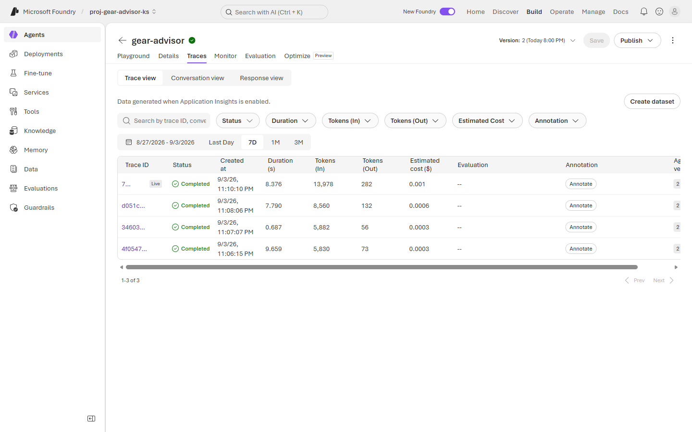
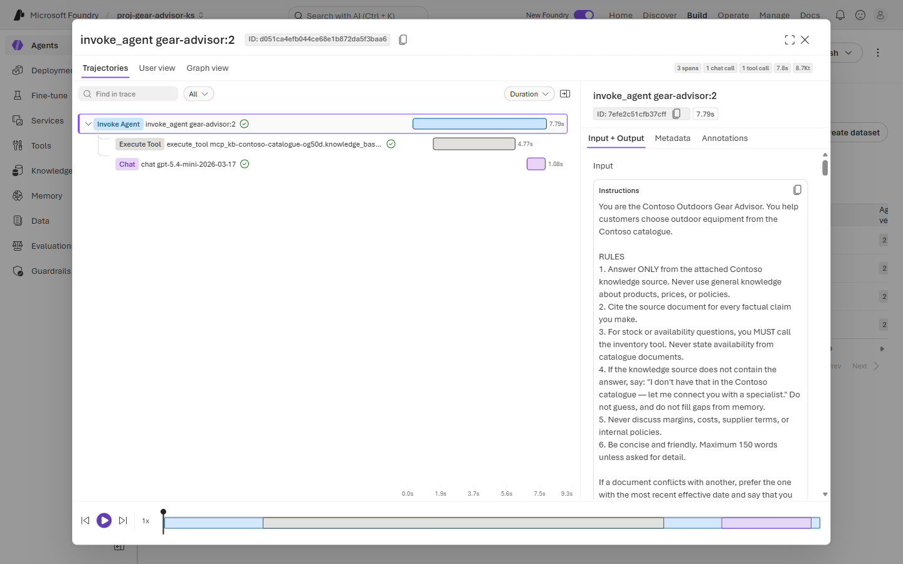
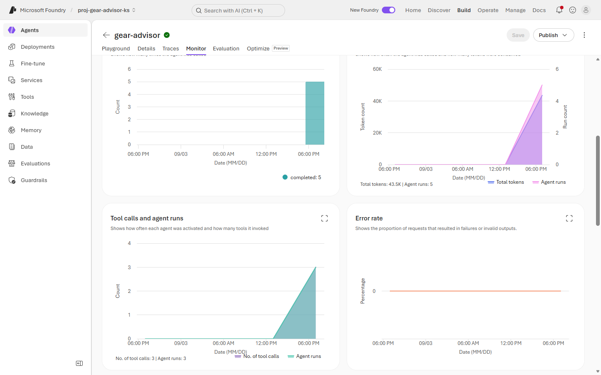

# Exercise 4: 🔭 Observability & tracing

**⏱️ ~10 minutes**

The operational question comes in two halves. This exercise answers the first: *"What is it actually doing?"* — [Exercise 5](./Exercise%205%20-%20Cost%20monitoring%20and%20FinOps.md) answers *"and what is it costing me?"*

You will read a trace span by span, then prove with a query that **the model is not your latency problem**.

This is **observability** in practice.

## ✅ Outcome

- A span tree walked end to end
- The measured split between retrieval time and model time
- A working KQL query against the telemetry the agent actually emits
- A documented gap: what the trace **does not** contain

> **Prerequisite:** Application Insights connected in [Exercise 1, Task 1.4](./Exercise%201%20-%20Identity,%20networking%20and%20landing%20zone%20hardening.md), and the traffic you generated before [Exercise 3](./Exercise%203%20-%20Evaluation.md).

---

### Task 4.1: Read the trace list

1. Open **Agents** → **`gear-advisor`** → the **Traces** tab. Leave the sub-tab on **Trace view** and the range on **7D**.

    

2. Every turn you sent is one row, with **Duration**, **Tokens (In)**, **Tokens (Out)** and **Estimated cost ($)** already computed. Note two things before moving on:

    | Observation | Why it matters |
    |---|---|
    | Tokens In dwarfs Tokens Out — 13,978 vs 282 on the largest turn | You pay mostly for what you *send*. Held over to [Exercise 5](./Exercise%205%20-%20Cost%20monitoring%20and%20FinOps.md). |
    | Durations range 0.687 s → 9.659 s for similar-looking questions | A 14× spread on a five-turn sample. Something variable is in the chain. |

3. Note what is **not** in this list: the **blocked jailbreak** from [Exercise 2](./Exercise%202%20-%20Guardrails%20and%20content%20safety.md) has no row.

    > 🔑 **The guardrail is not in the agent trace.** A request blocked at user input never becomes an agent run, so it produces no trace and no span tree. Your evidence that the block happened lives in the **Log Analytics diagnostic logs** you configured in [Exercise 1](./Exercise%201%20-%20Identity,%20networking%20and%20landing%20zone%20hardening.md), not here. Two telemetry paths, two different questions — do not assume one covers the other.

---

### Task 4.2: Walk the span tree

1. Click any **Trace ID** to open it.

    

2. The header summarises the run: **3 spans · 1 chat call · 1 tool call · 7.8 s · 8.7 Kt**. The tree is three levels:

    | Span | What it is | Duration | Share |
    |---|---|---|---|
    | `invoke_agent gear-advisor:2` | The whole turn | **7.79 s** | 100% |
    | `execute_tool mcp_kb-contoso-catalogue-…` | Retrieval from your knowledge base | **4.77 s** | **61%** |
    | `chat gpt-5.4-mini-2026-03-17` | The model call | **1.08 s** | 14% |

> 💡 Your span names and timings will differ — the model name reflects whichever version you deployed in [Exercise 2](../Lab%201%20-%20Build%20your%20first%20Agent%20on%20Foundry/Exercise%202%20-%20Deploy%20a%20model.md), and durations vary by region and load. What should hold is the **shape**: retrieval taking several times longer than the model call.

3. Select the top span and read **Input + Output** on the right. Your full system prompt is there verbatim — every rule you wrote in [Lab 1 Exercise 4](../Lab%201%20-%20Build%20your%20first%20Agent%20on%20Foundry/Exercise%204%20-%20Build%20and%20test%20your%20agent.md), on every single turn.

4. Select the **Execute Tool** span and read its arguments. For one user question the agent issued **three** rewritten search queries and got back **"Retrieved 10 documents"**.

    > 🔍 That is the answer to the 14× duration spread. Retrieval is doing query expansion and pulling ten documents into context — it is both the slowest step *and* the reason Tokens In is so large.

5. Note the tabs beside **Trajectories**: **User view** shows the conversation as the customer saw it; **Graph view** shows the same run as a node diagram. Same data, three framings.

> ⚠️ **What is missing from this tree.** There is no guardrail span, and no *separate* retrieval span — retrieval **is** the tool call, because the knowledge base is exposed to the agent as an MCP tool. If you are looking for a "retrieval" node, you will not find one. Read the tool span instead.

---

### Task 4.3: Prove it with a query

One trace is an anecdote. Query the whole set.

1. Open the **Log Analytics workspace** (`law-genai-workshop-<initials>`) in the Azure portal and select **Logs**.

2. Run this:

    ```kusto
    AppDependencies
    | where TimeGenerated > ago(1d)
    | where DependencyType == 'AI'
    | summarize
        calls    = count(),
        p50_ms   = round(percentile(DurationMs, 50)),
        p95_ms   = round(percentile(DurationMs, 95)),
        failures = countif(Success == false)
      by Name
    | order by p95_ms desc
    ```

    > ⚠️ **Use `AppDependencies`, not `requests` or `AppRequests`.** Agent spans are emitted as *dependencies*, not requests. Querying `AppRequests` returns an empty result and looks exactly like "telemetry isn't working". The tables that actually populate are `AppDependencies`, `AppEvents` and `AppGenAIContent`.

3. Your results will have this shape — the exact figures will differ:

    | Name | Calls | p50 ms | p95 ms | Failures |
    |---|---|---|---|---|
    | `invoke_agent gear-advisor:<n>` | one per turn | — | — | 0 |
    | `execute_tool …knowledge_base_retrieve` | fewer | **highest** | — | 0 |
    | `chat <your model>` | one per turn | **lowest** | — | 0 |

    In two runs of this lab, retrieval p50 was **4.4×** and **5.4×** the model p50.

4. Read the middle two rows together:

    > 🔑 **Retrieval dominates latency, by a multiple.** If someone asks you to make this agent faster, switching to a smaller model attacks the *smallest* slice. The bulk is in the search layer — chunk size, `top_k`, query expansion, semantic ranking, index region. Optimise where the time actually is, and note that this ratio is stable across runs even when the absolute numbers are not.

5. Note the **calls** column: your `invoke_agent` and `chat` counts will match your turn count, but the retrieval tool span will be **lower**. Some turns answered without retrieving at all.

    > 🔍 **Find those turns and read them — this is the most useful thing in the exercise.** A turn with no retrieval span is one of three things, and they are not equally acceptable:
    >
    > | No retrieval because… | Verdict |
    > |---|---|
    > | The agent correctly abstained (margins are genuinely absent) | ✅ Working as designed |
    > | The agent **abstained even though the answer is in the corpus** | ❌ Quality defect — the Lab 1 Exercise 4 price prompt does exactly this when it follows another abstention |
    > | The agent **answered confidently, with no citation** | 🚨 The dangerous one. It answered from the model's own memory while pretending to be grounded. |
    >
    > In our run one turn fell into the third category: a specific, correct-sounding price, no retrieval span, no citation. **Retrieval count is not a proxy for abstention count** — it is a list of turns that need reading. Cross-reference the trace list against your `AppGenAIContent` output messages and check which of the three you have.

    > 📌 Compare this with what [Exercise 3](./Exercise%203%20-%20Evaluation.md) told you. The `ToolCallSuccessEvaluator` almost certainly scored `0 / 0` or `1 / 1`, because it counts only function and OpenAPI calls — the knowledge-base retrieval you can plainly see here as an `execute_tool` span does **not** register as a tool call for that evaluator. Neither view is wrong; they are counting different things. **Reconcile your dashboards before you quote either.**

---

### Task 4.4: Check the Monitor tab

Foundry pre-builds the operational view so you don't have to.

1. Open the **Monitor** tab → **Overview**.

    

2. Record your numbers:

    | Metric | This lab | Yours |
    |---|---|---|
    | Agent runs | 5 | |
    | Total tokens | 43.5K | |
    | Tool calls | 3 | |
    | Error rate | 0% | |

3. Notice the two panels disagree: one reports *"Agent runs: 5"*, the other *"No. of tool calls: 3 | Agent runs: 3"* — the second counts only runs that invoked a tool.

    > 📌 Same word, two denominators, one screen. This is the same trap as the `1 / 1 = 100%` in [Exercise 3](./Exercise%203%20-%20Evaluation.md). Before you quote a dashboard number in a status report, find out what it is dividing by.

4. **Open in Azure Monitor** takes you to the full workbook if you need alerting, retention or cross-resource queries.

---

## 🧾 Checkpoint

- [ ] Trace list read; input/output token asymmetry noted
- [ ] Blocked jailbreak confirmed **absent** from traces
- [ ] Span tree walked; retrieval identified as the tool span
- [ ] KQL run against `AppDependencies` returning per-span p50/p95
- [ ] Retrieval-vs-model latency ratio recorded
- [ ] Monitor tab numbers captured, with denominators understood

---

## 🧠 What we learned

- **Retrieval, not the model, dominates latency** — several times the model p50 in every run we measured.
- **Retrieval is the tool span.** There is no separate retrieval node to look for.
- **Guardrail blocks leave no trace.** Security evidence lives in diagnostic logs; performance evidence lives in App Insights.
- **Query `AppDependencies`.** An empty `AppRequests` result is a wrong query, not a broken pipeline.
- **Read denominators on dashboards.** Two panels can report different values for the same word.

---

**Previous:** [◀️ Exercise 3](./Exercise%203%20-%20Evaluation.md) · **Next:** [Exercise 5 — Cost monitoring & FinOps ▶️](./Exercise%205%20-%20Cost%20monitoring%20and%20FinOps.md)
