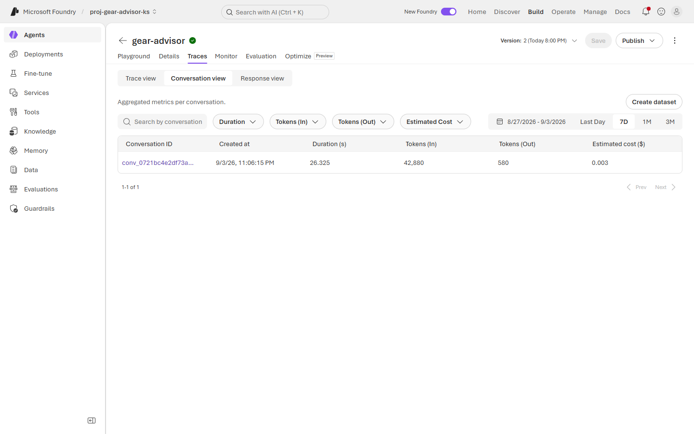
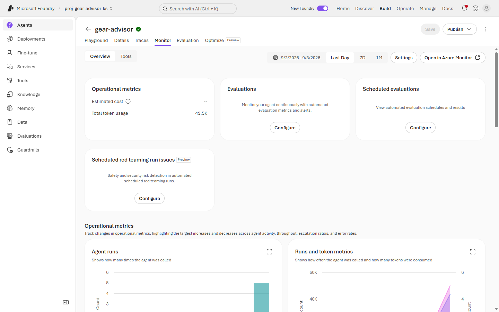

# Exercise 5: 💰 Cost monitoring & FinOps

**⏱️ ~8 minutes**

The FinOps question: *"What does this cost, and what happens when we have ten thousand users?"*

You will find that the model is the cheap part, that the user's question is a rounding error in the bill, and that naive token math overstates your cost — by a factor you can bound rather than guess.

This is **FinOps for AI** in practice.

## ✅ Outcome

- Cost measured at the **conversation** grain, not the turn
- The input:output token ratio quantified
- Prompt caching found, and its effect on the bill
- A break-even calculation against fixed infrastructure

---

### Task 5.1: Cost the conversation, not the turn

1. Open **Agents** → **`gear-advisor`** → **Traces** → the **Conversation view** sub-tab.

    

2. Five turns collapse into **one row**:

    | Duration | Tokens (In) | Tokens (Out) | Estimated cost |
    |---|---|---|---|
    | 26.325 s | **42,880** | **580** | **$0.003** |

3. Compute the ratio: `42,880 ÷ 580 =` **73.9 : 1**.

    > 🔑 **You pay ~74× more for what you send than for what you get back.** Every prompt-engineering instinct that adds context — more rules, more few-shot examples, more retrieved chunks — lands on the expensive side of that ratio. Trimming the model's output length saves almost nothing.

4. **Conversation view is the grain that matters.** Users don't send turns, they have conversations. A per-turn cost of $0.0006 sounds free; $0.003 per conversation × 10,000 conversations/day is **$900/month**, and that is with a five-turn ceiling.

---

### Task 5.2: Find where the tokens actually go

Switch back to **Trace view** and read Tokens (In) turn by turn — or run this in **Log Analytics**:

```kusto
AppDependencies
| where TimeGenerated > ago(1d)
| where Name startswith 'chat'
| extend
    inTok  = toint(Measurements['gen_ai.usage.input_tokens']),
    outTok = toint(Measurements['gen_ai.usage.output_tokens']),
    cached = toint(Measurements['gen_ai.usage.cached_tokens'])
| project TimeGenerated, inTok, outTok, cached
| order by TimeGenerated asc
```

| Turn | Tokens In | Tokens Out | Cached |
|---|---|---|---|
| 1 | 5,830 | 73 | 0 |
| 2 | 5,882 | 56 | 0 |
| 3 | 8,560 | 132 | 5,977 |
| 4 | 8,630 | 37 | 5,465 |
| 5 | **13,978** | 282 | **8,537** |

Three findings, in order of how much money they represent:

1. **Turn 1 already costs 5,830 input tokens** — before the conversation has any history. That is your system prompt plus ten retrieved documents. The user's actual question, *"What is the waterproof rating of the Summit 2P tent?"*, is about 12 tokens.

    > 📌 **The user's question is a rounding error.** ~99.8% of turn 1's input cost is your own configuration. Cost control is a design decision you make before launch, not something you tune from usage later.

2. **Turn 5 costs 2.4× turn 1** and the user did not ask a longer question. Conversation history accumulates and is re-sent on every turn. Cost grows with conversation *length*, not just conversation *count* — so a UX change that encourages longer chats is a pricing change.

3. **Caching starts at turn 3**, covering 61% of turn 5's input.

---

### Task 5.3: Check your token math against the bill

1. Sum the raw counts. In our run: **42,880 in / 580 out**, of which **19,979 input tokens were cache reads** — 47% of all input.

2. Now do the naive calculation a spreadsheet would do: `total_input × input_rate + total_output × output_rate`, treating every input token as full price.

3. Work out the **most** that caching alone can explain. Cache reads bill at a discount — commonly ~50%, and never less than free — so the naive figure can overstate the cached portion by at most 2×:

    ```text
    naive / actual  ≤  1 / (1 − cache_share)
    ```

    At a 47% cache share that ceiling is **1.9×**, and at a realistic 50% discount it is about **1.3×**. The multiplier is rate-independent — the price per token cancels — so you can sanity-check it without knowing your rates.

4. Compare all three against the portal's own **Estimated cost**. If the gap is bigger than caching can account for, **caching is not the whole story** — batching, a different billed model version, free-tier allowances or rounding are all in play. Go and find the rest before you build a forecast on it.

    > 🔑 **Do not forecast from raw token counts.** Report `cached_tokens` alongside `input_tokens`, and reconcile against the invoice rather than a spreadsheet. A capacity plan built on unadjusted tokens is wrong in the expensive direction — you will over-provision, or worse, reject a viable design on a bad number.

    > 💡 Caching rewards a **stable prefix**. Because your system prompt is byte-identical on every turn, it caches. Injecting a timestamp, a session ID or a shuffled example list at the top of your prompt destroys the cache and quietly multiplies your bill. Put volatile content **last**.

    > 📌 **Watch when caching kicks in.** Ours started at turn 3 in one run and turn 2 in another — it depends on prefix length and provider behaviour, not on a fixed turn number.

---

### Task 5.4: The fixed cost nobody budgets for

1. Open the **Monitor** tab → **Overview**.

    

2. Note the panel: **Total token usage 43.5K**, but **Estimated cost `--`**. The per-trace cost column is populated; this rollup is not.

    > 📌 A dash is not zero. Never report "no cost shown" as "no cost incurred" — go to **Cost analysis** in the Azure portal for the authoritative figure.

3. In the Azure portal, open your resource group → **Cost analysis**, and group by **Service name**. Your model spend is fractions of a cent. Your **Azure AI Search** line is not.

4. Do the break-even. A provisioned **Standard S1** search service — the normal production choice for RAG — is **$0.34/hour** in West US 2:

    | | |
    |---|---|
    | S1, per month (730 h × $0.34) | **$248.20** |
    | Your measured cost per conversation | **$0.003** |
    | Conversations needed to equal the index | **≈ 82,700 / month** |

    > 🔑 **You must serve ~2,750 conversations a day before the model costs as much as the box the index sits on.** Below that, your AI bill is not an AI bill — it is an infrastructure bill, and it accrues at 3 a.m. on a Sunday when nobody is using the agent.

5. This lab's search service is **serverless** ($0.24/hour compute while active, $0.20/GB-month storage) rather than provisioned, which is why the demo is cheap. Confirm which you have before quoting a number to anyone.

> 🧹 **Shut it down.** The Azure AI Search service is the only resource here that can accrue meaningful cost after the workshop ends. If you are done, delete the resource group — see [Clean-up](../README.md#-clean-up).

---

### Task 5.5: Write the controls down

| Control | Why | Yours |
|---|---|---|
| **Budget + alert** on the resource group | The only control that fires when nobody is looking | |
| Cost **per conversation** target | The turn grain hides multi-turn growth | |
| Max turns / context window per session | Turn 5 cost 2.4× turn 1 | |
| `top_k` and chunk size | Ten documents per question is a *cost* setting as much as a quality one | |
| Stable prompt prefix | Protects the ~47% cache discount | |
| Right-size the model | Only 14% of latency, but re-check as traffic grows | |
| Review idle infrastructure monthly | The search index bills whether or not anyone asks a question | |

> 📌 Set the budget alert **before** you launch. Discovering an overrun on the invoice is discovering it 30 days late.

---

## 🧾 Checkpoint

- [ ] Cost per conversation recorded from Conversation view
- [ ] Input:output ratio calculated (~74:1 in our run)
- [ ] Per-turn token growth observed and explained
- [ ] `cached_tokens` found, and the naive-vs-actual gap **bounded** by the cache share
- [ ] Break-even against a provisioned search index calculated
- [ ] Budget alert configured on the resource group
- [ ] Resource group deleted if you are finished

---

## 🧠 What we learned

- **Cost the conversation, not the turn.** Per-turn numbers look free and hide multi-turn growth.
- **Input dominates output by ~74:1.** Optimise what you send.
- **The user's question is a rounding error** — your prompt and retrieved context are the bill.
- **Cached tokens make naive forecasts too high — but only up to `1 / (1 − cache_share)`.** If your gap exceeds that, something else is going on and you need to find it.
- **The largest line item is idle infrastructure**, not inference — tens of thousands of conversations a month to match one search index.

---

**Previous:** [◀️ Exercise 4](./Exercise%204%20-%20Observability%20and%20tracing.md) · **Back to:** [Lab 2 overview](./README.md)
