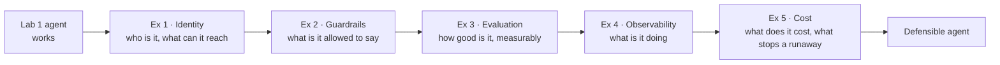

# 🧪 Hands-on Lab 2: Secure, evaluate & monitor your first agent

**⏱️ 02:00 – 02:50 (50 minutes)**

Your agent works. The next question is different: *"Can I trust it, prove it, and pay for it?"*

In this lab you take the `gear-advisor` from Lab 1 and make it **defensible**: hardened identity and networking, enforced guardrails, a measured quality baseline, and live monitoring with cost alerting.

---

## 🎯 Lab objectives

By the end of this lab you will have:

- ✅ Managed identity and least-privilege RBAC replacing personal credentials
- ✅ A guardrail policy blocking jailbreak, harmful content and protected material
- ✅ An evaluation run producing a quality baseline with named thresholds
- ✅ Telemetry flowing to Log Analytics, with traces you can read span by span
- ✅ A measured **cost per conversation**, and the controls that stop a runaway

---

## 📚 Exercises

| # | Exercise | Time |
|---|---|---|
| 1 | [Identity, networking and landing zone hardening](./Exercise%201%20-%20Identity,%20networking%20and%20landing%20zone%20hardening.md) | 10m |
| 2 | [Guardrails & content safety](./Exercise%202%20-%20Guardrails%20and%20content%20safety.md) | 10m |
| 3 | [Evaluation](./Exercise%203%20-%20Evaluation.md) | 12m |
| 4 | [Observability & tracing](./Exercise%204%20-%20Observability%20and%20tracing.md) | 10m |
| 5 | [Cost monitoring & FinOps](./Exercise%205%20-%20Cost%20monitoring%20and%20FinOps.md) | 8m |

---

## 📋 Before you start

- [ ] [Lab 1](../Lab%201%20-%20Build%20your%20first%20Agent%20on%20Foundry/README.md) is complete and `gear-advisor` responds with citations
- [ ] You have covered the afternoon topics — landing zone, observability & evaluation, and FinOps for AI
- [ ] Your project endpoint is still in your scratch file

---

## 🧭 The mental model for this lab

Each exercise answers one question your stakeholders will actually ask.

---

## 🆘 If you get stuck

| Symptom | Most likely cause |
|---|---|
| RBAC change has no effect | Role assignments can take several minutes to propagate |
| Guardrail doesn't trigger | Severity threshold set too permissively, or the policy isn't attached to the agent |
| Evaluation run stalls | Don't close the page mid-run; check the model deployment has TPM headroom |
| **Existing traces** list is empty in the evaluation wizard | The project identity needs **Monitoring Reader** on Application Insights — use the portal's **Resolve** button |
| **"Verifying access" never clears after Resolve** | Give it 2–5 minutes; if it persists, grant **Monitoring Reader** to the *Foundry resource* identity as well as the project's |
| **Your evaluator scores don't match the lab's** | Expected — scores are not reproducible. Read the `.reason` column and the denominators instead |
| **A metric shows a red 0% with `0 / 0`** | No samples, not a failure. `ToolCallSuccessEvaluator` ignores knowledge-base retrieval |
| No traces appearing | Application Insights not connected to the project, or fewer than 5 minutes since the traffic |
| KQL returns nothing | You queried `AppRequests`. Agent spans are dependencies — query **`AppDependencies`** |
| Everything is blocked | Thresholds too strict — this is the useful half of the safety/utility trade-off |

---

**Start here ▶️ [Exercise 1 — Identity, networking and landing zone hardening](./Exercise%201%20-%20Identity,%20networking%20and%20landing%20zone%20hardening.md)**
